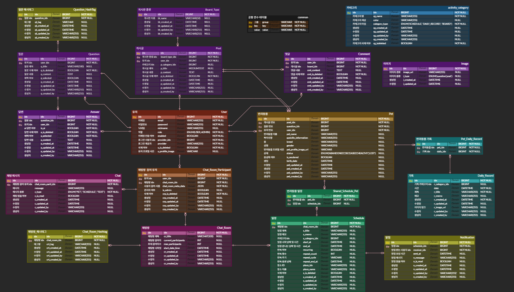

 

 

## 🕵️ 팀원 소개

> **[한화시스템 BEYOND SW캠프 12기] Final Project**  
> Team Hot6🔥

|            |          |        |      |
| :--------------------------------------------------------------: | :----------------------------------------------------------: | :--------------------------------------------------------: | :--------------------------------------------------------: |
| 🐳 **박동휘** [@parkdonghwi-git](https://github.com/donghwi) | 🐢 **유승호** [@seungho99](https://github.com/seungho99) | 🧶 **박세연** [@yeon7485](https://github.com/yeon7485) | ⚽ **안규호** [@Ahngyuho](https://github.com/Ahngyuho) |

 

### 목차

- [🐶 기술 스택](#-기술-스택)
- [🐱 펫로그 데모 사이트 링크](#-펫로그-데모-사이트-바로가기)
- [🐹 펫로그 서비스 소개](#-펫로그-서비스-소개)
- [🐦 백엔드 프로젝트 목표](#-백엔드-프로젝트-목표)
- [🐰 프로젝트 기획](#-프로젝트-기획)
- [🐟 프로젝트 설계](#-프로젝트-설계)
- [🐢 핵심 로직 상세 설명](#-핵심-로직-상세-설명)
- [🦎 프로젝트 폴더 바로가기](#-프로젝트-폴더-바로가기)

 
 

## 🐶 기술 스택

### 🎨 Frontend

 <!-- Vue.js -->
 <!-- 상태관리 라이브러리 -->

 <!-- Nginx -->

### 🧠 Backend

 <!-- 스프링 부트 -->
 <!-- 인증/인가 -->
 <!-- 클라우드 마이크로서비스 -->

### 🗄 DB

### ⚙️ CI/CD

 <!-- 컨테이너화 -->
 <!-- 오케스트레이션 -->
 <!-- CI/CD -->

### 💻 Etc

 <!-- 형상 관리 -->
 <!-- GitHub -->

  

## 🐱 펫로그 데모 사이트 바로가기

### [펫로그 사이트](https://www.petlog.kro.kr)</a>

 

## 🐹 펫로그 서비스 소개

#### 프로젝트 배경
- 반려동물 케어의 모든 것, 하나의 플랫폼으로 통합된 Petlog 서비스  

반려동물을 돌보는 일은 단순한 애정 표현을 넘어 체계적인 관리와 지속적인 관심이 필요한 일이다. 
그러나 현재 제공되는 서비스는 콘텐츠 소비나 단편적인 일정 기록에 그치는 경우가 많고, 이러한 기능들이 하나로 통합된 플랫폼은 매우 드문 실정이다. 
우리는 반려동물의 건강과 일상을 기록하고 관리할 수 있는 기능과 더불어, 반려인 간의 소통과 정보 공유를 가능하게 하는 커뮤니티 기능까지 아우르는 Petlog 서비스를 구축하였다.
 

- `통합 반려동물 관리` : 단순한 스케줄러가 아닌, 반려동물의 병원 방문, 예방접종, 산책, 미용 등 다양한 일정을 통합적으로 등록 및 조회하며 건강 상태를 지속적으로 관리할 수 있도록 지원한다. 
- `일상 기록 및 건강 모니터링` : 하루 단위로 사진, 이상 행동, 식사량 등 다양한 정보를 기록하고, 누적된 데이터를 기반으로 반려동물의 건강 변화를 추적한다. 
- `위치 기반 탐색 기능` : 현재 위치를 중심으로 가까운 동물병원, 미용실 등 주요 반려동물 관련 시설을 손쉽게 탐색할 수 있어 유사시 빠르게 대처 가능하다. 
- `스마트 알림 시스템` : 등록된 일정을 실시간으로 알림 받아 누락 없이 일정을 챙길 수 있으며, 반복 일정도 편리하게 설정 가능하다. 
- `그룹 채팅 및 커뮤니티 게시판` : 반려인들끼리 그룹 채팅을 통해 소통하고, 일정이나 반려동물 정보를 카드 형태로 공유할 수 있으며, 정보 공유/자유/Q&A 게시판을 통해 궁금증을 해소하고 다양한 팁을 나눌 수 있다. 
- `AI 기반 Q&A 지원` : Q&A 게시판에서는 질문에 대해 사용자와 **AI**가 함께 답변을 제공함으로써 빠르고 정확한 정보 획득이 가능하다. 

#### 세부 기능

- **`📇 반려동물 카드`** 
  반려동물 정보를 카드 형식으로 등록 및 관리
- **`📆 일정 관리`** 
  단순한 스케줄러가 아닌, 반려동물의 병원 방문, 예방접종, 산책, 미용 등 다양한 일정을 통합적으로 등록 및 조회하며 반려동물 지속적으로 관리할 수 있도록 지원
- **`🧾 일일 기록`** 
  반려동물의 건강 상태, 이상 현상, 오늘의 사진 등 일일 단위로 기록 및 관리
- **`📍 위치 기반 탐색`** 
  현재 위치를 기준으로 주변 동물병원, 펫샵 등의 반려동물 시설 탐색
- **`🔔 일정 알림`** 
  스케줄 알림을 실시간 알림으로 받아볼 수 있는 기능
- **`💬 그룹 채팅 및 이벤트 채팅방`** 
  사용자들이 실시간으로 소통하고, 채팅방에서 일정 또는 반려동물 카드도 함께 공유, 제한된 시간과 인원 안에서만 참여할 수 있는 이벤트 전용 채팅방 제공
- **`🪧 커뮤니티 게시판 및 Q&A`** 
  반려인들이 자유롭게 소통하고 정보를 나눌 수 있는 자유게시판, 정보게시판, Q&A 게시판을 제공 + Q&A 게시판에서는 사용자와 AI가 함께 질문에 답변하며, 궁금증을 신속하고 정확하게 해결

 

---
## 🐦 백엔드 프로젝트 목표
- `RESTful API 설계 및 구현`: 클라이언트와의 명확한 데이터 통신을 위한 표준화된 API 제공

- `비즈니스 로직 처리`: 일정, 게시판, 채팅 등 핵심 기능의 안정적 처리와 예외 상황 대응 로직 구현

- `데이터베이스 설계 및 최적화`: 정규화된 구조 설계와 Index 활용 등을 통해 데이터 저장 효율 및 조회 성능 향상

- `보안 및 인증 처리`: JWT 및 Redis 기반 Refresh Token 관리로 안전한 인증 체계 구성

- `확장성과 유지보수성 고려`: 도메인 기반 계층 분리 및 서비스 객체 구조를 통해 유연한 기능 확장과 유지보수 가능하게 설계

- `외부 서비스 연동`: AWS S3 이미지 업로드, WebSocket 기반 실시간 채팅, MongoDB 및 Redis 활용 기능 구현
---
# 🐰 프로젝트 기획 

 

▶ [**🕙 WBS 바로가기**](https://docs.google.com/spreadsheets/d/10GJK2OFHPAkFplNyjtBtaEh8kxCxARNC_aAOHAJr77M/edit?usp=sharing)

▶ [**📑 요구사항 정의서 바로가기**](https://docs.google.com/spreadsheets/d/1-6Z2yJZRFkM0Ix6biRMdWBmkby0E4XW_g9UfPiDfsH4/edit?usp=sharing)

 

---
# 🐟 프로젝트 설계

 
  

    
<b>📝 ERD</b>
 
        
  

  

    
<b>⚙️ 시스템아키텍처</b>
 
        
  

▶ [**📃 API 명세서 바로가기**](http://3.36.75.118:8080/swagger-ui/index.html)

 

## 🐢 핵심 로직 상세 설명

### [📃 프로젝트 Wiki](https://github.com/beyond-sw-camp/be12-fin-HOT6-Petlog-BE/wiki)  

 

## 📂 프로젝트 폴더 바로가기

### [📃 frontend](https://github.com/beyond-sw-camp/be12-fin-HOT6-Petlog-FE)  
### [📃 devops](https://github.com/beyond-sw-camp/be12-fin-HOT6-Petlog-BE/tree/main/backend/devops)  

 
